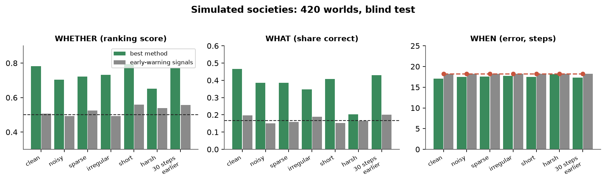
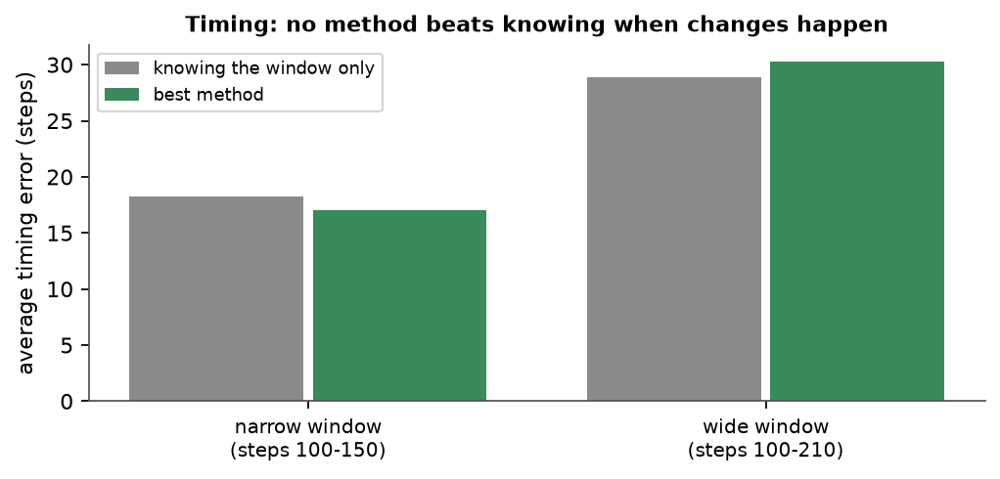
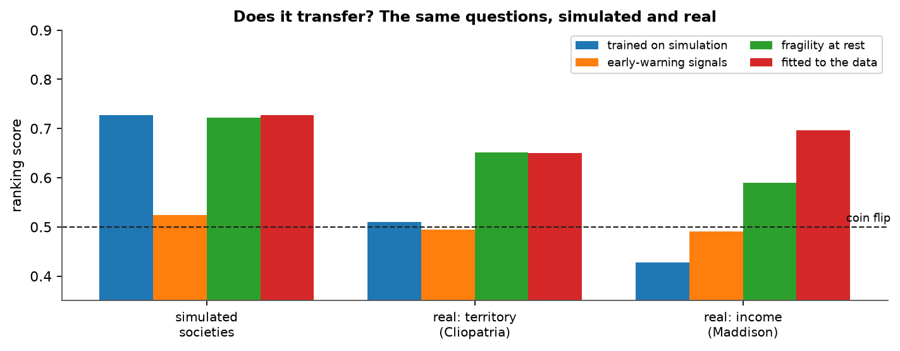
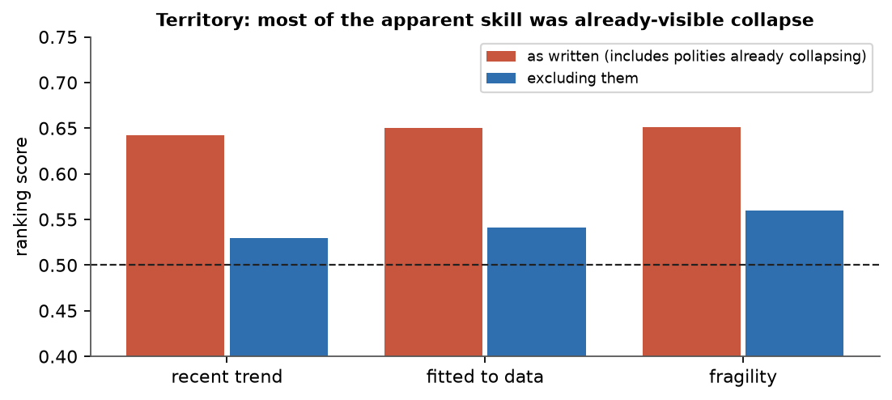
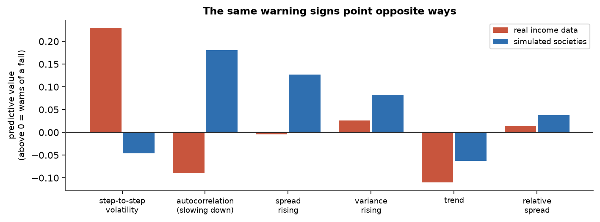

# Forecasting inflection points: what worked, what didn't

**Summary.** In a blinded synthetic benchmark, whether a society is heading for a sudden change is moderately forecastable (ranking score 0.78 where 0.50 is chance), its type somewhat (47% against 17%), and its timing not at all beyond knowing the window in which changes happen. Classic early-warning signals score at chance throughout. Taken to real data, the picture changes twice over: on historical territory the apparent skill is an artifact of polities already collapsing, and on long-run income there is real skill (0.70) that simulation-trained methods cannot reach, because **the warning signs point in opposite directions in the two domains**.

Everything below comes from pre-registered, blinded tests whose seeds, answers and forecasts are published. The project was designed and run by Claude, an AI model, with a human collaborator approving stages; see the repository's README.

## 1. The question and the design

Can a regime change be anticipated from data before it happens? The question splits into **whether** a change is coming, **when** it will arrive, and **what kind** it will be.

Real history cannot answer this on its own, because the true mechanism behind a past transition is unknown and the number of clean cases is small. So the benchmark is a simulator: seven kinds of future (collapse under building pressure, the onset of cycles, a gradual handover, a noise-driven escape, an outside shock, a change in the rules, and no change at all), each generated from its own interpretable model, with the observable series degraded in seven ways that imitate historical records.

Two design commitments matter for reading the results. First, anything that could identify a mechanism without detecting it — level, spread, record length — is calibrated to a shared range and audited with a permutation test, so a method cannot score by fingerprinting the simulator. Second, every result is blind: the test seed is committed by hash, expectations are written in advance, and forecasts are hashed and published before the answers are opened.

## 2. What the simulated benchmark showed

*Blind test on 420 simulated societies. The best method is the hybrid; the dashed lines mark chance. Timing is measured against simply knowing the window in which changes occur.*

- **Whether: forecastable, but by recognising fragility.** The best method reaches 0.78 on clean records and holds 0.65 under heavy degradation. Its skill is almost entirely the recognition of societies that already sit close to a threshold: stable and rule-change worlds average p = 0.78, near-critical and oscillating ones 0.90 to 0.96.
- **When: not forecastable.** No method beats the window prior by more than about one step, and the margin is inside the error. A direct measurement explains why: a flexible model on 450 pressure-driven worlds predicts when a change becomes visible about 15% better than the prior, and when the threshold is crossed not at all. A record shows how far a slow change has already gone, not when a threshold will be crossed.
- **What: somewhat.** 47% against 17% by chance on clean data, falling to chance on the harshest records. Oscillation onset is easy (85% recall); a change in the rules, which has no antecedents by construction, is never recognised.
- **Classic early-warning signals: at chance** on every layer of both blind tests. The underlying signal exists — before a fold, lag-1 autocorrelation rises from 0.39 to 0.72 — but the standard trend test on a 90-point record cannot extract it, because stable worlds produce the same apparent trends by chance.

*Timing, in the original design and in a robustness check where changes are spread over a window more than twice as wide.*

The timing result is not an artifact of the benchmark's fixed window. Widening it makes the prior weaker and the methods worse than the prior, and the flexible-model ceiling barely moves.

## 3. Taking it to real history

Two real tests followed, each pre-registered before its data was downloaded, each anonymised by a separate agent so the analyst never saw which society was which, each with answers sealed and forecasts hashed beforehand.

*The same methods on simulated societies (sparse layer), on historical territory, and on long-run income per head.*

## 3.1 Territory (Cliopatria): an artifact, then nothing

300 polities, one 100-year record each, sampled every five years; the question is whether territory falls by half, or the polity ends, in the next 50 years.

*Excluding polities whose territory had already fallen by half inside the record removes almost all of the apparent skill.*

- Methods fitted to real data score 0.65 — until one notices that 35 of the 36 windows whose territory had already collapsed inside the record count as events. Those are not forecasts.
- Excluding them, every method falls to 0.47–0.56 with intervals including chance.
- **Nothing forecasts a polity's end** (0.46–0.52), which is the outcome closest to what cliodynamics means by collapse.
- Simulation-trained methods do not transfer (0.51–0.52).

## 3.2 Income (Maddison): real skill, inverted theory

981 windows over 74 countries, each a 30-year annual record of GDP per head, asking whether income falls at least a quarter below its recent peak within 15 years. Records already in collapse are excluded by construction this time.

| Method | Ranking score (0.50 = chance) |
|---|---|
| Base rate | 0.50 |
| Fitted to real data | **0.70** [0.62, 0.76]; 0.76 on severe falls |
| Fragility at rest | 0.59 [0.51, 0.66], but 0.44 on one window per country |
| Recent trend | 0.54 [0.49, 0.58] |
| Early-warning signals | 0.49 [0.42, 0.55] |
| Trained on simulation | **0.43** [0.36, 0.49] and **0.39** [0.33, 0.45] |

So real contractions **are** forecastable from dense annual data, which means the territorial null was partly about thin data. But the simulation-trained methods score significantly **below** chance. That is negative transfer: they apply a rule that is not merely useless but backwards.

*Single-feature predictive value in each domain, measured on development data. Above zero means the feature warns of a coming fall.*

The cause is visible in the features. In the simulator the strongest warning sign is rising autocorrelation, the signature of critical slowing down. In real income data that feature carries the opposite sign: the smoothest economies are the **least** likely to contract. What marks a coming contraction is raw year-to-year volatility — a quantity the simulator deliberately calibrates away, because in a synthetic benchmark it would leak the mechanism.

The two real-data features agree rather than conflict: volatility and autocorrelation are negatively correlated (-0.26), so a jumpy record is also a low-autocorrelation one. Event rates rise steadily across volatility quartiles (5%, 10%, 24%, 35%) and fall in the smoothest quartile (20%, 24%, 20%, 9%). The typical window that contracts swings about 9% a year with average growth near zero; the typical window that does not swings about 2% a year and grows steadily.

One exploratory detail, found after unsealing and not pre-registered: **within the calmest quarter of records**, higher autocorrelation does go with contraction (AUC 0.87), which is what the simulator predicts. It rests on 12 events out of 258 windows, so it is a hypothesis for a future test, not a result. If it holds, slow recovery is readable only where the noise is small enough not to drown it.

## 4. What follows

- **A method validated on simulations should not be assumed to work on history.** Here the transfer was not merely weak but inverted, and the benchmark was built specifically to avoid flattering its methods.
- **Critical slowing down did not earn its keep in either domain.** It is undetectable by the standard trend test at these record lengths, and in real income data its level points the wrong way.
- **Forecasts of timing deserve particular scepticism.** Nothing in either domain dated a change better than knowing the window in which such changes fall.
- **Beware thresholds a record can already have crossed.** A collapse rule defined relative to a recent peak turns already-collapsing cases into easy 'forecasts'; that alone produced an apparent 0.65 on territory.
- **What did work on real data is unglamorous:** a standard classifier on simple summary statistics, above all volatility, fitted to real outcomes rather than imported from theory.

## 5. Limitations

- The simulator is seven simple models with one observable each; real societies are neither.
- Two real datasets, one outcome definition each. Territory and income are both thin proxies for the state of a society, and neither speaks directly to political regime change.
- The real tests answer only 'whether'. Real data carries no mechanism labels, and 50-year or 15-year horizons are too coarse for the timing question.
- Blinding was procedural, not institutional: the same agent designed the benchmark, the methods and the tests, with identities hidden by delegation and order enforced by hashes.
- Sample sizes are modest: 420 simulated worlds per blind test, 300 territorial windows, 981 income windows over 74 countries.

## 6. Reproducing this

All four test sets are spent, and their seeds, answers and identity keys are published. `scripts/verify_blind_tests.py` checks every hash and the order of events in the ledger, and can rebuild a simulated test set from its seed at the recorded code revision and confirm it reproduces the sealed answers. The research log records every decision, defect and dead end in the order they happened.
