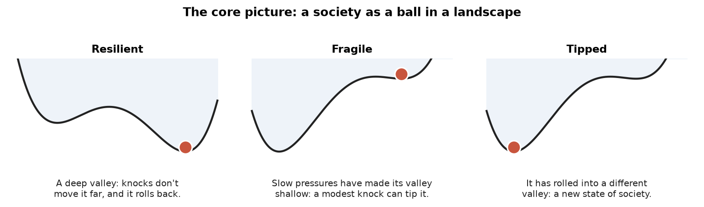
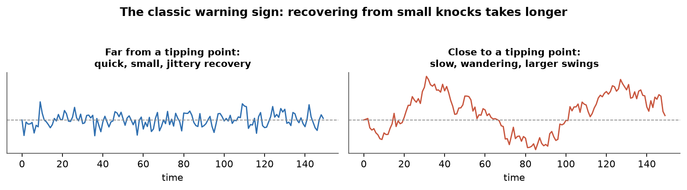
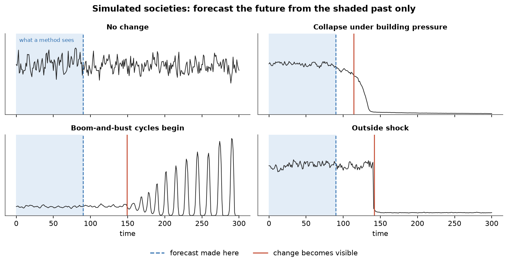
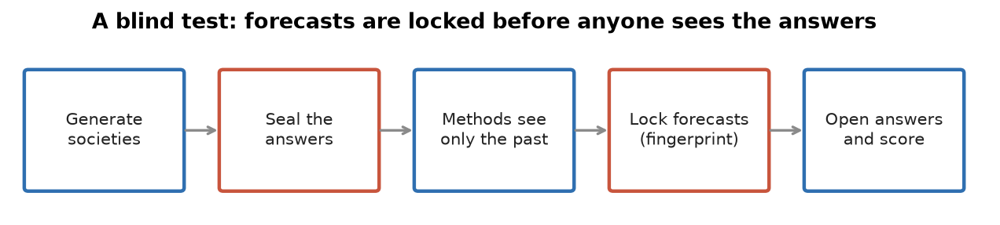
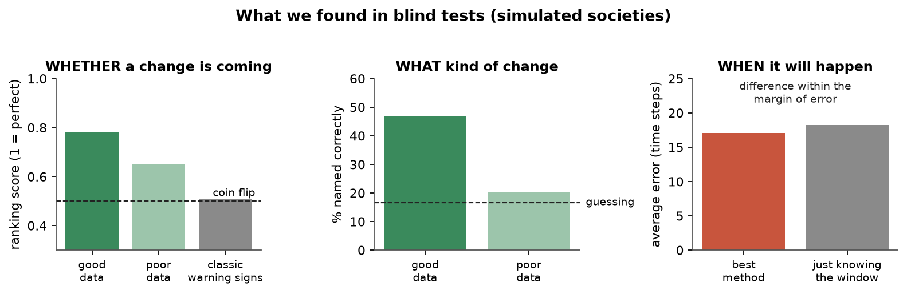

# Can we see a society's turning point coming?

A short, plain-language introduction to the KnotDetection project: what it asks, how it tests the question, what it has found so far, and what it cannot yet say.

## The question

Societies usually change slowly, but sometimes they shift suddenly: a state collapses, a long peace gives way to recurring unrest, an economy tips into a new pattern. The project asks whether such turning points can be anticipated using only data from before they happen. It splits that into three questions:

- **Whether** a sudden change is coming at all.
- **When** it will happen.
- **What kind** of change it will be.

The motivation comes from **cliodynamics**, a field that treats history quantitatively: it builds mathematical models of how population, wealth, elites and states interact, and looks for recurring patterns across societies. If those models capture something real, they should support forecasts, and forecasts can be tested. This project is about testing that ability honestly.

## The core idea: tipping points

*A system resting in a valley returns after small knocks. If slow pressures make the valley shallow, an ordinary knock can tip it into a different state.*

Mathematicians who study systems that change over time (**dynamical systems**) picture a system as a ball in a landscape. A society in a stable condition sits in a valley. Slow pressures, such as rising inequality or falling state revenue, can reshape the landscape so the valley grows shallower. Eventually a small push, or no push at all, sends the ball into another valley: a **tipping point**.

Different kinds of tipping point exist. A system can collapse outright, begin to oscillate in booms and busts, hand over gradually from one state to another, be knocked over by an outside shock, or change because its rules change. Telling these apart is the "what kind" question.

## The hoped-for warning sign

*Near a tipping point, a system takes longer to recover from small disturbances, so its fluctuations become slower and larger.*

Theory predicts a warning sign. As the valley flattens, the ball rolls back more slowly after each small knock. In data this shows up as fluctuations that are slower and larger: each value looks more like the one before. This "critical slowing down" has been used to anticipate shifts in lakes, climate and ecosystems, and has been applied to archaeological and historical data too.

## What we did

Real historical data are scarce, patchy, and the true causes of past transitions are debated, so they cannot tell us whether a method works. Instead we built a **simulator**: a program that generates thousands of artificial societies, each a single time series (think population or wealth) following one of seven futures. Because we made them, we know exactly what happens to each one and when.

*Four of the simulated societies. Methods see only the shaded stretch and must forecast what follows.*

Forecasting methods see only the early part of each society's history and must predict the rest. We also blurred the data in several ways (added noise, gaps, irregular dates, shorter records, indirect measurements) because real historical records look like that. We compared five methods, from a baseline that ignores the data, through the classic warning-sign approach, to machine-learning models.

## Keeping ourselves honest

*Answers are sealed before forecasting, and forecasts are fingerprinted and time-stamped before the answers are opened.*

The same person builds the methods and the tests, and it is easy to fool yourself. So every result comes from a **blind test**: the answers are sealed, predictions of the outcome are written down in advance, and every forecast is locked with a digital fingerprint before the answers are opened. We also checked repeatedly that the simulator does not accidentally give the answer away through something irrelevant, such as how noisy a series is. Several such flaws were found and fixed before testing.

## What we found so far

*Results of the second blind test (420 simulated societies). The first blind test gave very similar numbers.*

- **Whether** a change is coming can be judged moderately well on good data, and less well on poor data. The skill comes from spotting societies that already look fragile, not from detecting an approaching tipping point.
- **What kind** of change is somewhat predictable on good data (about half right, against one in six by guessing), but not on poor data.
- **When** is not predictable beyond knowing the rough window in which changes happen. The past shows how far a slow change has already gone, not when the tipping point will arrive.
- The **classic warning signs did no better than a coin flip**: with records this short, stable societies show apparent warning signs just as often by chance.
- Changes with no warning signs, such as a sudden change of rules, were not foreseen, as expected.

## Limitations

- **These are simulated societies**, built from simple models with one measured quantity each. Nothing here is yet a finding about real history.
- **Design choices shape the results.** For example, changes in the simulator happen within a fixed time window, which makes timing easier to guess than it may be in reality. One such choice (outside shocks only hitting fragile societies) was caught and fixed between the two tests; others may remain.
- **The methods are relatively simple.** Stronger ones might do better on "what kind", but the timing analysis suggests the information about "when" is simply not in the data.
- **Forecasts were made a limited distance ahead**, roughly 10 to 90 time steps before the change.

## What happened when we tried real history

Two tests on real data followed, each planned in writing before the data was downloaded, and each anonymised by a separate assistant so that recognising a famous case could not substitute for forecasting it.

- **Territory of 300 historical polities** (which lands a state held, over time). Almost all of the apparent skill turned out to be polities already visibly shrinking when the forecast was made. Excluding those, nothing beat a coin flip, and nothing at all predicted which states would disappear.
- **Income per person, annually, for 74 countries.** Here a simple model fitted to real history did predict large falls in income, and reasonably well.
- **But the methods trained on the simulated societies did worse than chance** on that same data. The reason is a reversal: in the simulations, a society heading for a tipping point recovers from small knocks more and more slowly, which makes its record look smoother, so smoothness reads as danger. In real income data smoothness means the opposite: steady growers rarely crashed, and the economies that fell were the jumpy ones, swinging about 9% a year against 2% for the rest. A method taught the simulated rule applies it backwards.

That is the project's sharpest practical lesson: a forecasting method that works on simulated data should not be assumed to work on history, even when the simulation was built carefully and tested honestly.

## A few terms

| Term | Meaning |
|---|---|
| Cliodynamics | The quantitative, model-based study of historical change. |
| Dynamical system | Anything whose state changes over time according to rules. |
| Tipping point | A threshold past which a system shifts suddenly to a new state. |
| Critical slowing down | Slower recovery from small knocks as a tipping point nears. |
| Blind test | Forecasts are locked before the answers are seen. |
| Ranking score | How often a method rates a society that changed as more likely to change than one that didn't; 0.5 is a coin flip, 1 is perfect. |
